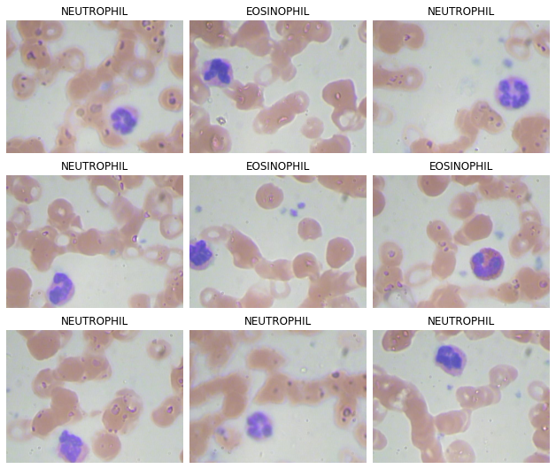
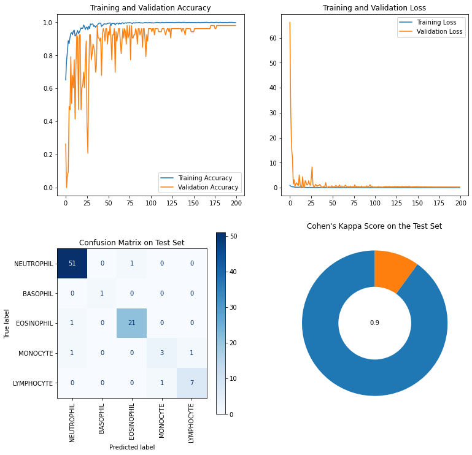

## Indentifying different leukocytes in blood sample images

This project is based on a task from [Kaggle](https://www.kaggle.com/paultimothymooney/blood-cells), and the code is [also uploaded there](https://www.kaggle.com/eugleo/opencv-object-selection-tensorflow-94-test-acc).

The notebook `model.ipynb` is written as a simple case study, highlighting the main steps of NN training in the context of biological image data.

## Results

I used OpenCV to isolate the RoIs from the samples, and I built a small model based on ResNet blocks to differentiate between the five types of leukocytes.

You can see the evaluation of the final model below.

I used Cohen's Kappa metric to evaluate the model because the testing dataset is very imbalanced and so accuracy or even averaged F1 score would be a bad fit.

However, I also calculated its accuracy and compared it with the three most popular publicly available models on Kaggle for this task.

| Notebook                                                                                                                  | Accuracy on the test set | # of parameters |
|---------------------------------------------------------------------------------------------------------------------------|--------------------------|-----------------|
| [My Model](https://www.kaggle.com/eugleo/opencv-object-selection-tensorflow-94-test-acc/) | 94% | 134,853 |
| [Identify Blood Cell Subtypes From Images](https://www.kaggle.com/paultimothymooney/identify-blood-cell-subtypes-from-images) | 90%                      | not provided    |
| [Blood Cell Keras Inception](https://www.kaggle.com/kartiksharma522/blood-cell-keras-inception)                               | 86% (on validation set)  | 363,825         |
| [Deep Learning From Scratch + Insights](https://www.kaggle.com/placidpanda/deep-learning-from-scratch-insights)              | 83%                      | 16,732          |

Keep in mind that the testing datasets were different so the models aren't directly comparable. Nevertheless, it seems that the resnet blocks are very effective.

## Future improvements

Further data augmentation could be utilised to make the model more robust, and would maybe allow me to increase the number of layers, and in turn, improve its performance. Proper (e.g. automated) hyperparameter tuning might also help push the effectivity of the model.

## References

Cohen's Kappa: McHugh, M. L. (2012). Interrater reliability: the kappa statistic. Biochemia medica, 22(3), 276-282.

ResNet: He, K., Zhang, X., Ren, S., & Sun, J. (2016). Deep residual learning for image recognition. In Proceedings of the IEEE conference on computer vision and pattern recognition (pp. 770-778).
